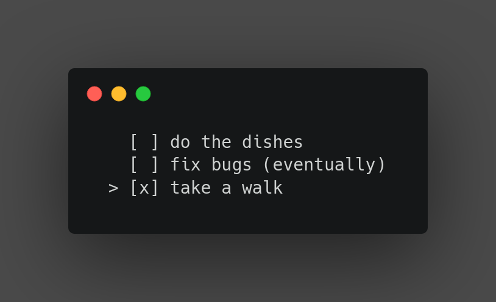
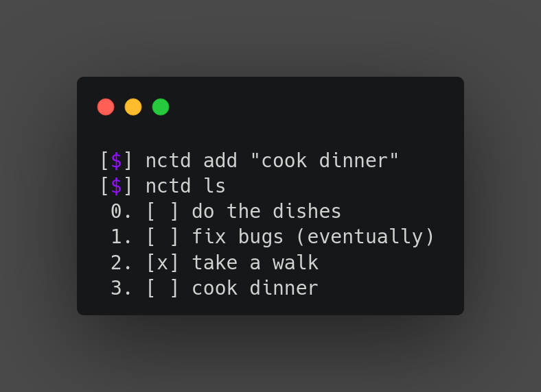

# nctd
a very bad ncurses todo

## installation
Clone the repository and compile the program:
```
$ git clone https://github.com/xelphif/nctd && cd nctd
$ make
```
Then copy the binary to your path. Optionally, you can run:
```
$ make install
```
which will copy the binary to `$HOME/.local/bin`.

## configuration
`nctd` looks for a configuration file in `$HOME/.config/nctd/config.toml`.

Available configuration values:
| Name | Description | Possible Values | Default |
| --- | --- | --- | --- |
| `filename` | Name of the outputted JSON file | String | `".todo.json"` |
| `finished_symbol` | Symbol for finished task | String | `"x"` |
| `unfinished_symbol` | Symbol for unfinished task | String | `" "` |
| `menu_marker` | Location marker for menu tui | String | `">"` |
| `pad` | Sets the x and y padding | Number | 0 |
| `pad_x` | Sets the x padding | Number | 0 |
| `pad_y` | Sets the y padding | Number | 0 |
| `center` | Center list in tui | `true`, `false` | `false` |

## command line
Along with the tui, `nctd` also includes a cli for convenience.

To view all of the subcommands:
```
$ nctd help
```

## previews

<p align=center>
  
</p>

<p align=center>
  
</p>
